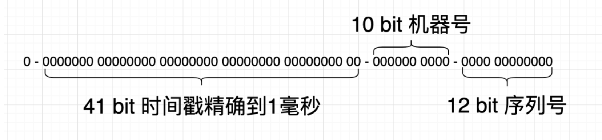
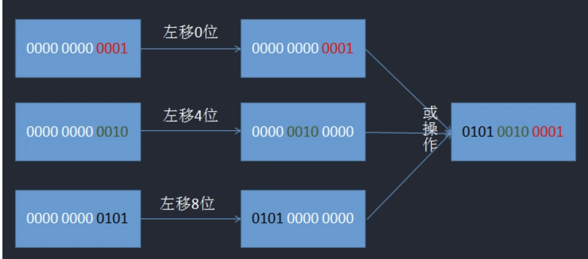

## 雪花算法

`author：asong`   `公众号：Golang梦工厂`

> 简介：唯一ID算法`SnowFlake`是Twitter公司提出来的算法。非常广泛的应用在各种业务系统里。这一篇我们我们学习一下原生的`SnowFlake`算法，
> 并用`go`实现一下。


### SnowFlake

原生Snowflake算法使用一个64 bit的整型数据，根据当前的时间来生成ID。 原生Snowflake结构如下：


- 最高位是标识位，为1表示附属，所以最高位不使用。
- 41bit 保存时间戳，精确到毫秒。也就是说最大可使用的年限是69年。41bit 可以表示 2^41 - 1  个数字。
也就是说 41 位可以表示 2^41−1 个毫秒的值，转化成单位年则是 (241−1)/(1000∗60∗60∗24∗365)=69 年
- 10bit 的机器位，能部属在1024台机器节点来生成ID。包括 5 位 dataCenterID 和 5 位 workerID。
- 12bit 的序列号，一毫秒最大生成唯一ID的数量为4096个。


#### 缺点及改进

原生的Snowflake算法是完全依赖于时间的，如果有时钟回拨的情况发生，会生成重复的ID，市场上的解决方案也是非常多的：

- 最简单的方案，就是关闭生成唯一ID机器的时间同步。
- 使用阿里云的的时间服务器进行同步，2017年1月1日的闰秒调整，阿里云服务器NTP系统24小时“消化”闰秒，完美解决了问题。
- 如果发现有时钟回拨，时间很短比如5毫秒,就等待，然后再生成。或者就直接报错，交给业务层去处理。
- 可以找2bit位作为时钟回拨位，发现有时钟回拨就将回拨位加1，达到最大位后再从0开始进行循环。


### 代码实现

#### 1. 首先定义一下snowFlake最基础的几个常量，每个常量的意义请看注释：

```go
const (
	workerIDBits =  uint64(5)  // 10bit 工作机器ID中的 5bit workerID
	dataCenterIDBits = uint64(5) // 10 bit 工作机器ID中的 5bit dataCenterID
	sequenceBits = uint64(12)

	maxWorkerID = int64(-1) ^ (int64(-1) << workerIDBits) //节点ID的最大值 用于防止溢出
	maxDataCenterID = int64(-1) ^ (int64(-1) << dataCenterIDBits)
	maxSequence = int64(-1) ^ (int64(-1) << sequenceBits)

	timeLeft = uint8(22)  // timeLeft = workerIDBits + dataCenterIDBits + sequenceBits // 时间戳向左偏移量
	dataLeft = uint8(17)  // dataLeft = dataCenterIDBits + sequenceBits
	workLeft = uint8(12)  // workLeft = sequenceBits // 节点IDx向左偏移量
	// 2020-05-20 08:00:00 +0800 CST
	twepoch = int64(1589923200000) // 常量时间戳(毫秒)
)

```
上述代码中 两个偏移量 timeShift 和 workLeft dataLeft 是对应图中时间戳和工作节点的位置
时间戳是在从右往左的 workerBits + dataCenterIDBits + sequenceBits (即22)位开始，大家可以数数看就很容易理解了
workLeft 同理

#### 2. Worker 工作节点

因为是分布式下的ID生成算法，所以我们要生成多个Worker，所以这里抽象出一个woker工作节点所需要的基本参数

```go
type Worker struct {
	mu sync.Mutex
	LastStamp int64 // 记录上一次ID的时间戳
	WorkerID int64 // 该节点的ID
	DataCenterID int64 // 该节点的 数据中心ID
	Sequence int64 // 当前毫秒已经生成的ID序列号(从0 开始累加) 1毫秒内最多生成4096个ID
}
```

#### 3. 实例化工作节点

由于是分布式情况下，我们应该通过外部配置文件或者其他方式为每台机器分配独立的id

```go
//分布式情况下,我们应通过外部配置文件或其他方式为每台机器分配独立的id
func NewWorker(workerID,dataCenterID int64) *Worker  {
	return &Worker{
		WorkerID: workerID,
		LastStamp: 0,
		Sequence: 0,
		DataCenterID: dataCenterID,
	}
}
```

#### 4. 获取ID

```go
func (w *Worker) getMilliSeconds() int64 {
	return time.Now().UnixNano() / 1e6
}

func (w *Worker)NextID() (uint64,error) {
	w.mu.Lock()
	defer w.mu.Unlock()


	return w.nextID()
}

func (w *Worker)nextID() (uint64,error) {
	timeStamp := w.getMilliSeconds()
	if timeStamp < w.LastStamp{
		return 0,errors.New("time is moving backwards,waiting until")
	}

	if w.LastStamp == timeStamp{
		// 这其实和 <==>
		// w.sequence++
		// if w.sequence++ > maxSequence  等价
		w.Sequence = (w.Sequence + 1) & maxSequence

		if w.Sequence == 0 {
			// 之前使用 if, 只是没想到 GO 可以在一毫秒以内能生成到最大的 Sequence, 那样就会导致很多重复的
			// 这个地方使用 for 来等待下一毫秒
			for timeStamp <= w.LastStamp {
				//i++
				//fmt.Println(i)
				timeStamp = w.getMilliSeconds()
			}
		}
	}else {
		w.Sequence = 0
	}

	w.LastStamp = timeStamp
	id := ((timeStamp - twepoch) << timeLeft) |
		(w.DataCenterID << dataLeft)  |
		(w.WorkerID << workLeft) |
		w.Sequence

	return uint64(id),nil
}
```

很多刚入门的朋友看到最后的`id := ((timeStamp - twepoch) << timeLeft) |
              		(w.DataCenterID << dataLeft)  |
              		(w.WorkerID << workLeft) |
              		w.Sequence`
会很懵逼，这里是对各部分的bit进行归位并通过按位或运算(就是这个‘|’)将其整合
     用一张图来解释
     


#### 5. 测试

```go
func main()  {
	w := idgen.NewWorker(5,5)

	ch := make(chan uint64,10000)
	count := 10000
	wg.Add(count)
	defer close(ch)
	//并发 count个goroutine 进行 snowFlake ID 生成
	for i:=0 ; i < count ; i++ {
		go func() {
			defer wg.Done()
			id,_ := w.NextID()
			ch <- id
		}()
	}
	wg.Wait()
	m := make(map[uint64]int)
	for i := 0; i < count; i++  {
		id := <- ch
		// 如果 map 中存在为 id 的 key, 说明生成的 snowflake ID 有重复
		_, ok := m[id]
		if ok {
			return
		}
		// 将 id 作为 key 存入 map
		m[id] = i
	}
	// 成功生成 snowflake ID
	fmt.Println("All", count, "snowflake ID Get successed!")

}
```