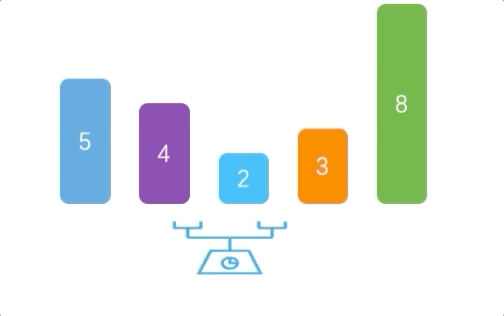
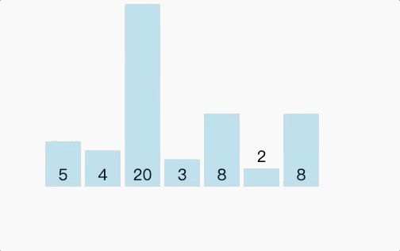
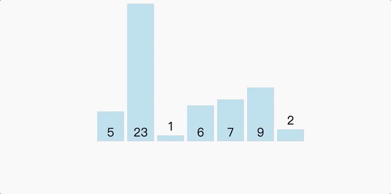
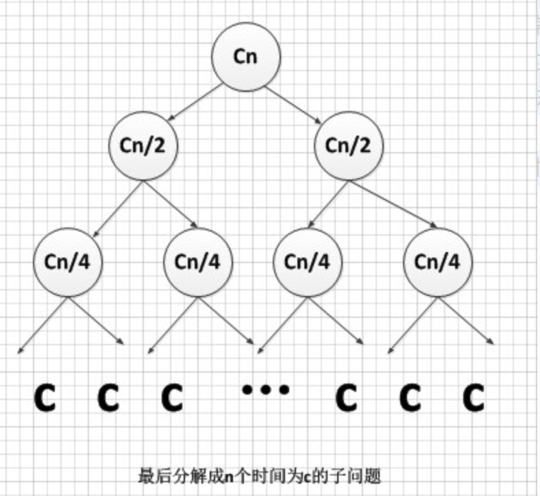
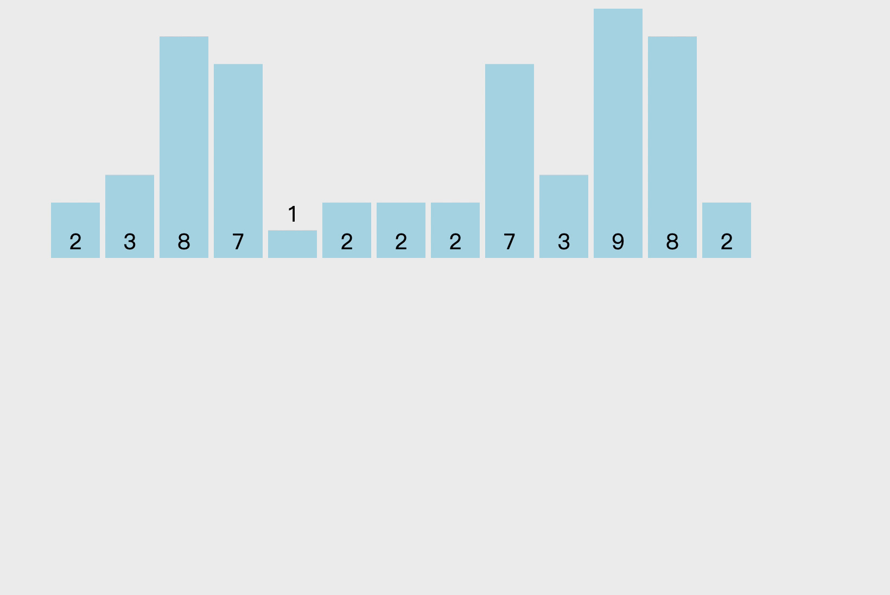

## 排序算法

`author：asong`   `公众号：Golang梦工厂`

> 简介：排序算法在我们日常开发中、面试中都会使用到，所以就打算弄一个合集，把常用的排序算法用`Go`实现一下。如果你还不会这些那就说不过去了哦～～～。


## 算法分类

我们常见的排序算法可以分为两大类：

- 比较类排序：通过比较来决定元素间的相对次序，由于其时间复杂度不能突破O(nlogn)，因此也称为非线性时间比较类排序。
- **非比较类排序**：不通过比较来决定元素间的相对次序，它可以突破基于比较排序的时间下界，以线性时间运行，因此也称为线性时间非比较类排序。


### 算法复杂度概览

| 排序算法 | 时间复杂度(平均) | 时间复杂度(最坏) | 时间复杂度(最优) | 空间复杂度     | 稳定性 |
| -------- | ---------------- | ---------------- | ---------------- | -------------- | ------ |
| 冒泡排序 | O(𝑛2)            | O(𝑛2)            | O(𝑛)             | O(1)           | 稳定   |
| 快速排序 | O(nlogn)         | O(𝑛2)            | O(nlogn)         | O(nlogn)～O(n) | 不稳定 |
| 插入排序 | O(𝑛2)            | O(𝑛2)            | O(𝑛)             | O(1)           | 稳定   |
| 希尔排序 | O(nlogn)~O(𝑛2)   | O(𝑛2)            | O(𝑛1.3)          | O(1)           | 不稳定 |
| 选择排序 | O(𝑛2)            | O(𝑛2)            | O(𝑛2)            | O(1)           | 稳定   |
| 堆排序   | O(nlogn)         | O(nlogn)         | O(nlogn)         | O(1)           | 不稳定 |
| 归并排序 | O(nlogn)         | O(nlogn)         | O(nlogn)         | O(n)           | 稳定   |
|          |                  |                  |                  |                |        |
| 计数排序 | O(n+k)           | O(n+k)           | O(n+k)           | O(k)           | 稳定   |
| 桶排序   | O(n+k)           | O(𝑛2)            | O(𝑛2)            | O(n+k)         | 稳定   |
| 基数排序 | O(n*k)           | O(n*k)           | O(n*k)           | O(n+k)         | 稳定   |

#### 时间、空间复杂度

在这里也简单解释一下什么是时间、空间复杂度吧。具体计算方法就不在这篇文章讲解了。

#### 1. 时间复杂度

时间复杂度是指执行这个算法所需要的计算工作量，其复杂度反映了程序执行时间**「随输入规模增长而增长的量级」**，在很大程度上能很好地反映出算法的优劣与否。一个算法花费的时间与算法中语句的**「执行次数成正比」**，执行次数越多，花费的时间就越多。一个算法中的执行次数称为语句频度或时间频度，记为T(n)，其中n称为问题的规模，当n不断变化时，它所呈现出来的规律，我们称之为时间复杂度。比如：=n^2+1)与=5n^2+2n+1)，虽然算法的时间频度不一样，但他们的时间复杂度却是一样的，**「时间复杂度只关注最高数量级，且与之系数也没有关系」**。通常一个算法由控制结构（顺序，分支，循环三种）和原操作（固有数据类型的操作）构成，而算法时间取决于两者的综合效率。

#### 2. 空间复杂度

空间复杂度是对一个算法在运行过程中临时占用存储空间大小的量度，所谓的临时占用存储空间指的就是代码中**「辅助变量所占用的空间」**，它包括为参数表中**「形参变量」**分配的存储空间和为在函数体中定义的**「局部变量」**分配的存储空间两个部分。我们用 S(n)=O(f(n))来定义，其中n为问题的规模(或大小)。通常来说，只要算法不涉及到动态分配的空间，以及递归、栈所需的空间，空间复杂度通常为0(1)。一个一维数组`a[n]`，空间复杂度O(n)，二维数组为O(n^2)。

#### 3. 大`O`表示方法

大O符号是由德国数论学家保罗·巴赫曼（Paul Bachmann）在其1892年的著作《解析数论》（Analytische Zahlentheorie）首先引入的。算法的复杂度通常用大O符号表述，定义为T(n) = O(f(n))。称函数T(n)以f(n)为界或者称T(n)受限于f(n)。 如果一个问题的规模是n，解这一问题的某一算法所需要的时间为T(n)。T(n)称为这一算法的“时间复杂度”。当输入量n逐渐加大时，时间复杂度的极限情形称为算法的“渐近时间复杂度”。空间复杂度同理。举个例子，令 = 2n^2 + 3n + 5)，) = O(2 n^2 + 3n + 5) = O(n^2))

好啦，算法的知识就简单介绍一下概念吧，因为这并不是本文的重点，下面我们我们一起来看看这几种排序。


## 1. 冒泡排序

### 1.1 算法步骤
- 比较相邻的元素。如果第一个比第二个大，就交换他们两个。
- 对每一对相邻元素作同样的工作，从开始第一对到结尾的最后一对。这步做完后，最后的元素会是最大的数。
- 针对所有的元素重复以上的步骤，除了最后一个。
- 持续每次对越来越少的元素重复上面的步骤，直到没有任何一对数字需要比较。

### 1.2 动画演示



### 1.3 代码示例(go实现)

```go
package main

import (
	"fmt"
)

type uint64Slice []uint64

func main()  {

	numbers := []uint64{5,4,2,3,8}
	sortBubble(numbers)
	fmt.Println(numbers)
}

func sortBubble(numbers uint64Slice)  {
	length := len(numbers)
	if length == 0{
		return
	}
	flag := true

	for i:=0;i<length && flag;i++{
		flag = false
		for j:=length-1;j>i;j--{
			if numbers[j-1] > numbers[j] {
				numbers.swap(j-1,j)
				flag = true // 有数据才交换
			}
		}
	}
}

// 交换方法
func (numbers uint64Slice)swap(i,j int)  {
	numbers[i],numbers[j] = numbers[j],numbers[i]
}
```

### 1.4 复杂度分析

分析一下他的时间复杂度吧。当最好的情况下，也就是要排序的表本身就是有序的，那么我们比较次数，根据我们的代码可以推断出来就是`n-1`次的比较，没有数据交换，时间复杂度为`O(n)`。当最坏情况下，即待排序表是逆序的，那么我们可以列出一个公式如下： , 因此可以计算出冒泡排序的时间复杂度为`O(n2)`。因为我们的代码在运行时运行过程中临时占用存储空间大小的量度没有变化，所以空间复杂度仍为`O(1)`。


## 2. 快速排序

### 2.1 算法步骤

- 从数列中挑出一个元素，称为 “基准”（pivot）;
- 重新排序数列，所有元素比基准值小的摆放在基准前面，所有元素比基准值大的摆在基准的后面（相同的数可以到任一边）。在这个分区退出之后，该基准就处于数列的中间位置。这个称为分区（partition）操作；
- 递归地（recursive）把小于基准值元素的子数列和大于基准值元素的子数列排序；


### 2.2 动画演示



### 2.3 代码示例

```go
package main

import (
	"fmt"
)

type uint64Slice []uint64


func main()  {
	numbers := []uint64{5,4,20,3,8,2,8}
	quickSort(numbers,0,len(numbers)-1)
	fmt.Println(numbers)
}

func quickSort(numbers uint64Slice,start,end int)  {
	var middle int
	tempStart := start
	tempEnd := end

	if tempStart >= tempEnd{
		return
	}
	pivot := numbers[start]
	for start < end{
		for start < end && numbers[end] > pivot{
			end--
		}
		if start<end{
			numbers.swap(start,end)
			start++
		}
		for start < end && numbers[start] < pivot{
			start++
		}
		if start<end{
			numbers.swap(start,end)
			end--
		}
	}
	numbers[start] = pivot
	middle = start

	quickSort(numbers,tempStart,middle-1)
	quickSort(numbers,middle+1,tempEnd)

}


// 交换方法
func (numbers uint64Slice)swap(i,j int)  {
	numbers[i],numbers[j] = numbers[j],numbers[i]
}
```


### 2.4 复杂度分析

快速排序涉及到递归调用，所以该算法的时间复杂度还需要从递归算法的复杂度开始说起；
递归算法的时间复杂度公式：T[n] = aT[n/b] + f(n)  ；对于递归算法的时间复杂度这里就不展开来说了。

-  最优情况

 快速排序最优的情况就是每一次取到的元素都刚好平分整个数组(很显然我上面的不是)；

 此时的时间复杂度公式则为：T[n] = 2T[n/2] + f(n)；T[n/2]为平分后的子数组的时间复杂度，f[n] 为平分这个数组时所花的时间；

​    下面来推算下，在最优的情况下快速排序时间复杂度的计算(用迭代法)：

```
T[n] =  2T[n/2] + n              ----------------第一次递归
令：n = n/2        =  2 { 2 T[n/4] + (n/2) }  + n     ----------------第二次递归
                  =  2^2 T[ n/ (2^2) ] + 2n

令：n = n/(2^2)   =  2^2  {  2 T[n/ (2^3) ]  + n/(2^2)}  +  2n    ----------------第三次递归  
                 =  2^3 T[  n/ (2^3) ]  + 3n
......................................................................................                        
令：n = n/(  2^(m-1) )    =  2^m T[1]  + mn   ----------------第m次递归(m次后结束)

当最后平分的不能再平分时，也就是说把公式一直往下跌倒，到最后得到T[1]时，说明这个公式已经迭代完了（T[1]是常量了）。
得到：T[n/ (2^m) ]  =  T[1]    ===>>   n = 2^m   ====>> m = logn；
T[n] = 2^m T[1] + mn ；其中m = logn;
T[n] = 2^(logn) T[1] + nlogn  =  n T[1] + nlogn  =  n + nlogn  ；其中n为元素个数
又因为当n >=  2时：nlogn  >=  n  (也就是logn > 1)，所以取后面的 nlogn；
综上所述：快速排序最优的情况下时间复杂度为：O( nlogn )
```


- 最差情况

最差的情况就是每一次取到的元素就是数组中最小/最大的，这种情况其实就是冒泡排序了(每一次都排好一个元素的顺序)
这种情况时间复杂度就好计算了，就是冒泡排序的时间复杂度：T[n] = n \* (n-1) = n^2 + n;
综上所述：快速排序最差的情况下时间复杂度为：O( n^2 )

- 空间复杂度

首先就地快速排序使用的空间是O(1)的，也就是个常数级；而真正消耗空间的就是递归调用了，因为每次递归就要保持一些数据；
最优的情况下空间复杂度为：O(logn)  ；每一次都平分数组的情况。
最差的情况下空间复杂度为：O( n )    ；退化为冒泡排序的情况。


## 3. 插入排序

### 3.1 算法步骤

- 将第一待排序序列第一个元素看做一个有序序列，把第二个元素到最后一个元素当成是未排序序列。
- 从头到尾依次扫描未排序序列，将扫描到的每个元素插入有序序列的适当位置。（如果待插入的元素与有序序列中的某个元素相等，则将待插入元素插入到相等元素的后面。）

### 3.2 动画演示


### 3.3 代码示例

```go
package main

import (
	"fmt"
)

type uint64Slice []uint64

func main()  {
	numbers := []uint64{5,4,20,3,8,2,9}
	insertSort(numbers)
	fmt.Println(numbers)
}

func insertSort(numbers uint64Slice)  {
	for i:=1; i < len(numbers); i++{
		tmp := numbers[i]
		// 从待排序序列开始比较,找到比其小的数
		j:=i
		for j>0 && tmp<numbers[j-1] {
			numbers[j] = numbers[j-1]
			j--
		}
		// 存在比其小的数插入
		if j!=i{
			numbers[j] = tmp
		}
	}
}


// 交换方法
func (numbers uint64Slice)swap(i,j int)  {
	numbers[i],numbers[j] = numbers[j],numbers[i]
}
```


### 3.4 复杂度分析

我们来分析一下这个算法，从空间上来看，它只需要一个记录的辅助空间，因此关键是看它的时间复杂度。在最好的情况，我们要排序的表本身就是有序的，那我们的比较次数就是上面代码`tmp<numbers[j-1]`的比较，因此没有移动记录，时间复杂度为O(n)。当最坏情况，即待排序表是逆序的情况，此时需要比较 ,而记录的移动次数也达到最大值 次。如果排序记录是随机的，那么根据概率相同的原则，平均比较和移动次数约为`𝑛2/4`次。因此，我们得出直接插入排序法的时间复杂度为`O(𝑛2)`。从这里也可以看出，同样的`O(𝑛2)`时间复杂度，直接插入排序比冒泡排序性能要好一些。


## 4 希尔排序

### 4.1 算法步骤

- 选择一个增量序列 t1，t2，……，tk，其中 ti > tj, tk = 1；
- 按增量序列个数 k，对序列进行 k 趟排序；
- 每趟排序，根据对应的增量 ti，将待排序列分割成若干长度为 m 的子序列，分别对各子表进行直接插入排序。仅增量因子为 1 时，整个序列作为一个表来处理，表长度即为整个序列的长度。

### 4.2 动画演示


### 4.3 代码示例

```go
package main

import (
	"fmt"
	"math"
)

type uint64Slice []uint64

func main()  {
	numbers := []uint64{8,9,1,7,2,3,5,4,6,0}
	shellSort(numbers)
	fmt.Println(numbers)
}

func shellSort(numbers uint64Slice)  {
	gap := 1
	for gap < len(numbers){
		gap = gap * 3 + 1
	}
	for gap > 0{
		for i:= gap; i < len(numbers); i++{
			tmp := numbers[i]
			j := i - gap
			for j>=0 && numbers[j] > tmp{
				numbers[j+gap] = numbers[j]
				j -= gap
			}
			numbers[j+gap] = tmp
		}
		gap = int(math.Floor(float64(gap / 3)))
	}
}
```


### 4.4 复杂度分析

通过上面的代码我们可以分析，希尔排序的关键并不是随便分组后各自排序，而是将相隔某个"增量"的记录组成一个子序列，实现跳跃式的移动，使得排序的效率提高。这里的"增量"选取就非常关键了。我们是用`gap = gap * 3 + 1`的方式选取增量，可究竟应该选取什么样的增量才是最好的呢？目前还是数学难题，迄今为止还没有人找到一种最好的增量序列。不过大量研究表明，当增量序列为时，可以获得不错的效率，其时间复杂度为`O(n3/2)`，要好于直接排序的`O(n2)`。需要注意的是，增量最后一个增量值必须等于1才行。因为记录是跳跃式移动，希尔排序并不是一种稳定的排序算法。


## 5. 选择排序

### 5.1 算法步骤

- 首先在未排序序列中找到最小（大）元素，存放到排序序列的起始位置
- 再从剩余未排序元素中继续寻找最小（大）元素，然后放到已排序序列的末尾。
- 重复第二步，直到所有元素均排序完毕。


### 5.2 动画演示



### 5.3 代码示例

```go
package main

import (
	"fmt"
)

type uint64Slice []uint64

func main()  {
	numbers := []uint64{5,23,1,6,7,9,2}
	selectSort(numbers)
	fmt.Println(numbers)
}

func selectSort(numbers uint64Slice)  {
	for i := 0; i < len(numbers) - 1; i++{
		// 记录最小值位置
		min := i

		for j:= i+1; j<len(numbers);j++{
			if numbers[j] < numbers[min]{
				min = j
			}
		}
		if i != min{
			numbers.swap(i,min)
		}
	}
}

// 交换方法
func (numbers uint64Slice)swap(i,j int)  {
	numbers[i],numbers[j] = numbers[j],numbers[i]
}
```


### 5.4 复杂度分析

从简单选择排序的过程来看，他最大的特点就是交换移动数据次数相当少，这样也就节约了相应的时间。分析它的时间复杂度发现，无论最好最差的情况，其比较次数都是一样的多，第`i`趟排序需要进行`n-i`次关键字的比较，此时需要比较。而对于交换次数而言，当最好的时候，交换为0次，最差的时候，也就初始降序时，交换次数为`n-1`次，基于最终的排序时间是比较与交换的次数总和，因此，总的时间复杂度依然为`O(n2)`。虽然与冒泡排序同为`O(n2)`，但选择排序的性能上还是要略优于冒泡排序的。


## 6. 堆排序

### 6.1 算法步骤

堆排序（Heapsort）是指利用堆这种数据结构所设计的一种排序算法。堆积是一个近似完全二叉树的结构，并同时满足堆积的性质：即子结点的键值或索引总是小于（或者大于）它的父节点。

- 将初始待排序关键字序列(R1,R2….Rn)构建成大顶堆，此堆为初始的无序区；
- 将堆顶元素R[1]与最后一个元素R[n]交换，此时得到新的无序区(R1,R2,……Rn-1)和新的有序区(Rn),且满足R[1,2…n-1]<=R[n]；
- 由于交换后新的堆顶R[1]可能违反堆的性质，因此需要对当前无序区(R1,R2,……Rn-1)调整为新堆，然后再次将R[1]与无序区最后一个元素交换，得到新的无序区(R1,R2….Rn-2)和新的有序区(Rn-1,Rn)。不断重复此过程直到有序区的元素个数为n-1，则整个排序过程完成。


### 6.2 动画演示


### 6.3 代码示例

```go
package main

import (
	"fmt"
)

type uint64Slice []uint64

func main()  {
	numbers := []uint64{5,2,7,3,6,1,4}
	sortHeap(numbers)
	fmt.Println(numbers)
}

func sortHeap(numbers uint64Slice)  {
	length := len(numbers)
	buildMaxHeap(numbers,length)
	for i := length-1;i>0;i--{
		numbers.swap(0,i)
		length -=1
		heapify(numbers,0,length)
	}
}

// 构造大顶堆
func buildMaxHeap(numbers uint64Slice,length int)  {
	for i := length / 2; i >= 0; i-- {
		heapify(numbers, i, length)
	}
}

func heapify(numbers uint64Slice, i, length int) {
	left := 2*i + 1
	right := 2*i + 2
	largest := i
	if left < length && numbers[left] > numbers[largest] {
		largest = left
	}
	if right < length && numbers[right] > numbers[largest] {
		largest = right
	}
	if largest != i {
		numbers.swap(i, largest)
		heapify(numbers, largest, length)
	}
}

// 交换方法
func (numbers uint64Slice)swap(i,j int)  {
	numbers[i],numbers[j] = numbers[j],numbers[i]
}
```

### 6.4 复杂度分析

堆排序的运行时间主要消耗在初始构建堆和在重建堆时的反复筛选上。在构建堆的过程中，因为我们是完全二叉树从最下层最右边的非终端节点开始构建，将它与其孩子进行比较，若有必要的交换，对于每个非终端节点来说，其实最多进行两次比较和呼唤操作，因此整个构建堆的时间复杂度为`O(n)`。

在正式排序时，第`i`次取堆顶记录重建堆需要用`O(logi)`的时间(完全二叉树的某个节点到根结点的距离为`|logi|+1`)，并且需要取`n-1`次堆顶记录，因此，重建堆的时间复杂度为`O(nlogn)`。

所以总体来说，堆排序的时间复杂度为`O(nlogn)`。由于堆排序对原始记录的排序状态并不敏感，因此他无论是最好、最坏和平均时间复杂度均为`O(nlogn)`。这在性能上显然要远远好过于冒泡、简单选择、直接插入的`O(n2)`的时间复杂度了。

空间复杂度上，他只有一个用来交换的暂存单元，也非常的不错。不过由于记录的比较与交换是跳跃式进行的，因此堆排序也是一种不稳定的排序方法。**注意：由于初始构建堆所需的比较次数较多，因此，他并不适合待排序序列个数较少的情况。**


## 7.  归并排序

### 7.1 算法步骤

- 申请空间，使其大小为两个已经排序序列之和，该空间用来存放合并后的序列；
- 设定两个指针，最初位置分别为两个已经排序序列的起始位置；
- 比较两个指针所指向的元素，选择相对小的元素放入到合并空间，并移动指针到下一位置；
- 重复步骤 3 直到某一指针达到序列尾；
- 将另一序列剩下的所有元素直接复制到合并序列尾。

### 7.2 动画演示


### 7.3 代码示例

```go
package main

import (
	"fmt"
)

type uint64Slice []uint64

func main()  {
	numbers := []uint64{3,44,38,5,47,15,36,26,27,2,46,4,19,50,48}
	res := mergeSort(numbers)
	fmt.Println(res)
}

func mergeSort(numbers uint64Slice) uint64Slice {
	length := len(numbers)
	if length < 2{
		return numbers
	}
	middle := length/2
	left := numbers[0:middle]
	right := numbers[middle:]
	return merge(mergeSort(left),mergeSort(right))
}

func merge(left uint64Slice,right uint64Slice) uint64Slice {
	result := make(uint64Slice,0)
	for len(left) != 0 && len(right) != 0 {
		if left[0] <= right[0] {
			result = append(result, left[0])
			left = left[1:]
		} else {
			result = append(result, right[0])
			right = right[1:]
		}
	}

	for len(left) != 0 {
		result = append(result, left[0])
		left = left[1:]
	}

	for len(right) != 0 {
		result = append(result, right[0])
		right = right[1:]
	}

	return result
}

// 交换方法
func (numbers uint64Slice)swap(i,j int)  {
	numbers[i],numbers[j] = numbers[j],numbers[i]
}
```

### 7.4 复杂度分析

可以说合并排序是比较复杂的排序，特别是对于不了解分治法基本思想的同学来说可能难以理解。总时间=分解时间+解决问题时间+合并时间。分解时间就是把一个待排序序列分解成两序列，时间为一常数，时间复杂度o(1).解决问题时间是两个递归式，把一个规模为n的问题分成两个规模分别为n/2的子问题，时间为2T(n/2).合并时间复杂度为o（n）。总时间T(n)=2T(n/2)+o(n).这个递归式可以用递归树来解，其解是o(nlogn).此外在最坏、最佳、平均情况下归并排序时间复杂度均为o(nlogn).从合并过程中可以看出合并排序稳定。 

用递归树的方法解递归式T(n)=2T(n/2)+o(n):假设解决最后的子问题用时为常数c，则对于n个待排序记录来说整个问题的规模为cn。

 


## 8. 计数排序

### 8.1 算法步骤

- 花O(n)的时间扫描一下整个序列 A，获取最小值 min 和最大值 max
- 开辟一块新的空间创建新的数组 B，长度为 ( max - min + 1)
- 数组 B 中 index 的元素记录的值是 A 中某元素出现的次数
- 最后输出目标整数序列，具体的逻辑是遍历数组 B，输出相应元素以及对应的个数

### 8.2 动画演示




### 8.3 代码示例

```go
package main

import (
	"fmt"
)

type uint64Slice []uint64

func main()  {
	numbers := []uint64{2, 3, 8, 7, 1, 2, 2, 2, 7, 3, 9, 8, 2}

	countSort(numbers,getMaxValue(numbers))
	fmt.Println(numbers)
}

func countSort(numbers uint64Slice,maxValue uint64) {
	bucketLen := maxValue + 1
	bucket := make(uint64Slice,bucketLen) // 初始都是0的数组
	sortedIndex := 0

	for _,v:= range numbers{
		bucket[v] +=1
	}
	var j uint64
	for j=0;j<bucketLen;j++{
		for bucket[j]>0{
			numbers[sortedIndex] = j
			sortedIndex +=1
			bucket[j] -= 1
		}
	}
}


func getMaxValue(numbers uint64Slice) uint64{
   maxValue := numbers[0]
   for _,v:=range numbers {
	   if maxValue < v {
		   maxValue = v
	   }
   }
   	return maxValue
}
```


### 8.4 复杂度分析

这个算法不是基于比较的排序算法，因此它的下界可以优于Ω(nlgn)，甚至这个算法都没有出现比较元素的操作。这个算法很明显是**稳定的**，也就是说具有相同值得元素在输出数组中的相对次序和他们在输入数组中的相对次序相同。算法中的循环时间代价都是线性的，还有一个常数k，因此时间复杂度是Θ(n+k)。当k=O(n)时，我们采用计数排序就很好，总的时间复杂度为Θ(n)。

计数排序是**复杂度为O(n+k)的稳定的排序算法**，k是待排序列最大值，适用在对**最大值不是很大的整型元素序列**进行排序的情况下（整型元素可以有负数，我们可以把待排序列整体加上一个整数，使得待排序列的最小元素为0，然后执行计数排序，完成之后再变回来。这个操作是线性的，所以计数这样做计数排序的复杂度仍然是O(n+k)）。本质上是一种空间换时间的算法，如果k比较小，计数排序的效率优势是很明显的，当k变得很大的时候，这个算法可能就不如其他优秀的排序算法。


## 9. 桶排序

### 9.1 算法步骤

桶排序是计数排序的升级版。这个是利用了函数的映射关系，是否高效就在于这个映射函数的确定。所以为了使桶排序更加高效，我们要保证做到以下两点：

```go
1. 在额外空间充足的情况下，尽量增大桶的数量
2. 使用的映射函数能够将输入的 N 个数据均匀的分配到 K 个桶中
```

- 设置固定数量的空桶。
- 把数据放到对应的桶中。
- 对每个不为空的桶中数据进行排序。
- 拼接不为空的桶中数据，得到结果

最后，对于桶中元素的排序，选择何种比较排序算法对于性能的影响至关重要。

### 9.2 动画演示


### 9.3 代码示例

```go
package main

import (
	"fmt"
)

func main()  {
	numbers := []uint64{5,3,4,7,4,3,4,7}
	sortBucket(numbers)
	fmt.Println(numbers)
}

func sortBucket(numbers []uint64) {
	num := len(numbers) // 桶数量
	max := getMaxValue(numbers)
	buckets := make([][]uint64,num)
	var index uint64
	for _,v := range numbers{
		// 分配桶 index = value * (n-1)/k
		index = v * uint64(num-1) / max

		buckets[index] = append(buckets[index],v)
	}

	// 桶内排序
	tmpPos := 0
	for k:=0; k < num; k++ {
		bucketLen := len(buckets[k])
		if bucketLen>0{
			sortUseInsert(buckets[k])
			copy(numbers[tmpPos:],buckets[k])
			tmpPos +=bucketLen
		}
	}
}

func sortUseInsert(bucket []uint64)  {
	length := len(bucket)
	if length == 1 {return}
	for i := 1; i < length; i++ {
		backup := bucket[i]
		j := i -1
		for  j >= 0 && backup < bucket[j] {
			bucket[j+1] = bucket[j]
			j --
		}
		bucket[j + 1] = backup
	}
}

//获取数组最大值
func getMaxValue(numbers []uint64) uint64{
	max := numbers[0]
	for i := 1; i < len(numbers); i++ {
		if numbers[i] > max{ max = numbers[i]}
	}
	return max
}
```

### 9.4 复杂度分析

**1. 时间复杂度**

因为时间复杂度度考虑的是最坏的情况，所以桶排序的时间复杂度可以这样去看(只看主要耗时部分，而且常熟部分K一般都省去)

- N次循环，每一个数据装入桶
- 然后M次循环，每一个桶中的数据进行排序(每一个桶中有N/M个数据)，假设为使用比较先进的排序算法进行排序

一般较为先进的排序算法时间复杂度是O(N*logN)，实际的桶排序执行过程中，桶中数据是以链表形式插入的，那么整个桶排序的时间复杂度为:

```
O(N)+O(M*(N/M)*log(N/M))=O(N*(log(N/M)+1))
```

**所以，理论上来说(N个数都符合均匀分布)，当M=N时，有一个最小值为O(N)**

*PS:这里有人提到最后还有M个桶的合并，其实首先M一般远小于N，其次再效率最高时是M=N，这是就算把这个算进去，也是O(N*(1+log(N/M)+M/N))，极小值还是O(2*N)=O(N)*

```
求M的极小值，具体计算为:(其中N可以看作一个很大的常数)
F(M) = log(N/M)+M/N) = LogN-LogM+M/N
它的导函数
F'(M) = -1/M + 1/N
因为导函数大于0代表函数递增，小于0代表函数递减
所以F(M)在(0,N) 上递减
在(N,+∞)上递增
所以当M=N时取到极小值
```

**2. 空间复杂度**

空间复杂度一般指算法执行过程中需要的额外存储空间

桶排序中，需要创建M个桶的额外空间，以及N个元素的额外空间

所以桶排序的空间复杂度为 **O(N+M)**

**3. 稳定性·**

稳定性是指，比如a在b前面，a=b，排序后，a仍然应该在b前面，这样就算稳定的。

桶排序中，假如升序排列，a已经在桶中，b插进来是永远都会a右边的(因为一般是从右到左，如果不小于当前元素，则插入改元素的右侧)

**所以桶排序是稳定的**

**PS:当然了，如果采用元素插入后再分别进行桶内排序，并且桶内排序算法采用快速排序，那么就不是稳定的**

**用排序主要适用于均匀分布的数字数组，在这种情况下能够达到最大效率**


## 10. 基数排序

### 10.1 算法步骤

基数排序与桶排序、计数排序都用到了桶的概念，但对桶的使用方法上有明显差异：

- 基数排序：根据键值的每位数字来分配桶；
- 计数排序：每个桶只存储单一键值；
- 桶排序：每个桶存储一定范围的数值；


基数排序按取数方向分为两种：从左取每个数列上的数，为**最高位优先（Most Significant Digit first, MSD）**；从右取每个数列上的数，为**最低位优先（Least Significant Digit first, LSD）**。
下列以LSD为例。

基数排序步骤：

- 将所有待比较数值（正整数）统一为同样的数位长度，数位较短的数前面补零
- 从最低位开始，依次进行一次排序
- 从最低位排序一直到最高位排序完成以后, 数列就变成一个有序序列


### 10.2 动画演示


### 10.3 代码示例

```go
package main

import (
	"fmt"
)

func main()  {
	numbers := []uint64{3221, 1, 10, 9680, 577, 9420, 7, 5622, 4793, 2030, 3138, 82, 2599, 743, 4127}
	radixSort(numbers)
	fmt.Println(numbers)
}

func radixSort(numbers []uint64)  {
	key := maxDigits(numbers)
	tmp := make([]uint64,len(numbers),len(numbers))
	count := new([10]uint64)
	length := uint64(len(numbers))
	var radix uint64 =  1
	var i, j, k uint64
	for i = 0; i < key; i++ { //进行key次排序
		for j = 0; j < 10; j++ {
			count[j] = 0
		}
		for j = 0; j < length; j++ {
			k = (numbers[j] / radix) % 10
			count[k]++
		}
		for j = 1; j < 10; j++ { //将tmp中的为准依次分配给每个桶
			count[j] = count[j-1] + count[j]
		}
		for j = length-1; j > 0; j-- {
			k = (numbers[j] / radix) % 10
			tmp[count[k]-1] = numbers[j]
			count[k]--
		}
		for j = 0; j < length; j++ {
			numbers[j] = tmp[j]
		}
		radix = radix * 10
	}
}


//获取数组的最大值的位数
func maxDigits(arr []uint64) (ret uint64) {
	ret = 1
	var key uint64 = 10
	for i := 0; i < len(arr); i++ {
		for arr[i] >= key {
			key = key * 10
			ret++
		}
	}
	return
}
```

### 10.4 复杂度分析

**如果使用桶排序或者计数排序（必需是稳定排序算法），时间复杂度可以做到 O(n)。**如果要排序的数据有 k 位，那我们就需要 k 次桶排序或者计数排序，总的时间复杂度是 O(kn)。当 k 不大的时候，比如手机号码排序的例子，基数排序的时间复杂度就近似于 O(n)。

基数排序对要排序的数据要求如下：

1. 需要分割出独立的"位"来比较，而且位之间可以进行比较。
2. 每一位的数据范围不能太大，要可以用线性排序算法来排序，否则，基数排序的时间复杂度就无法做到 O(n)。
3. 如果排序的元素位数不一样，位数不够的可以在后面补位。


## 总结

这篇文章总结到这里就结束了，花费了好长时间耶(动画太难弄了)～～。这排序算法长时间不写都快忘光了，这一次又重新整理了一遍，收获很大。虽然这些算法是很简单的算法，但是却很重要，日常开发都会用到，所以大家一定要学好。希望这篇文章对你们有用。如果觉得不错，给个三连吧（点赞、看一看，分享），这就对笔者的最大鼓励，感谢啦～～～。

**好啦，这一篇文章到这就结束了，我们下期见～～。希望对你们有用，又不对的地方欢迎指出，可添加我的golang交流群，我们一起学习交流。**

**结尾给大家发一个小福利吧，最近我在看[微服务架构设计模式]这一本书，讲的很好，自己也收集了一本PDF，有需要的小伙可以到自行下载。获取方式：关注公众号：[Golang梦工厂]，后台回复：[微服务]，即可获取。**

**最近被吐槽说我写的代码太丑陋了，所以最近也在看`clean code`这本书，有需要的小伙伴公众号自取哈。获取方式：关注公众号：[Golang梦工厂]，后台回复：[code]，即可获取**

**我翻译了一份GIN中文文档，会定期进行维护，有需要的小伙伴后台回复[gin]即可下载。**

**翻译了一份Machinery中文文档，会定期进行维护，有需要的小伙伴们后台回复[machinery]即可获取。**

**我是asong，一名普普通通的程序猿，让gi我一起慢慢变强吧。我自己建了一个`golang`交流群，有需要的小伙伴加我`vx`,我拉你入群。欢迎各位的关注，我们下期见~~~**


推荐往期文章：

- [machinery-go异步任务队列](https://mp.weixin.qq.com/s/4QG69Qh1q7_i0lJdxKXWyg)
- [go参数传递类型](https://mp.weixin.qq.com/s/JHbFh2GhoKewlemq7iI59Q)
- [手把手教姐姐写消息队列](https://mp.weixin.qq.com/s/0MykGst1e2pgnXXUjojvhQ)
- [常见面试题之缓存雪崩、缓存穿透、缓存击穿](https://mp.weixin.qq.com/s?__biz=MzIzMDU0MTA3Nw==&mid=2247483988&idx=1&sn=3bd52650907867d65f1c4d5c3cff8f13&chksm=e8b0902edfc71938f7d7a29246d7278ac48e6c104ba27c684e12e840892252b0823de94b94c1&token=1558933779&lang=zh_CN#rd)
- [详解Context包，看这一篇就够了！！！](https://mp.weixin.qq.com/s/JKMHUpwXzLoSzWt_ElptFg)
- [go-ElasticSearch入门看这一篇就够了(一)](https://mp.weixin.qq.com/s/mV2hnfctQuRLRKpPPT9XRw)
- [面试官：go中for-range使用过吗？这几个问题你能解释一下原因吗](https://mp.weixin.qq.com/s/G7z80u83LTgLyfHgzgrd9g)